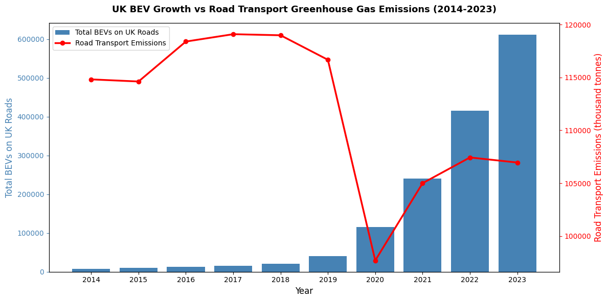

# ZEV Mandate — Data Analysis

The data used to make the graph in this page is taken from the Office for National Statistics (ONS) and 
the Department for Transport (DfT)

---

This graph shows the total number of Battery Electric Vehicles on UK roads in a specific year (represented by the blue bars) 
while comparing them to the total greenhouse gas emissions from the transport sector, in thousands of tonnes, in that year 
(shown by the red line). In 2014, the number of BEVs on UK roads was very little, with hardly 10,000 of them. This number 
didn't show any significant increase up until 2018, where numbers jumped from 50,000 to 120,000 in 2020. That then almost 
doubled to around 250,000 in 2021. It then increased again 410,000 in 2022 and then to 610,000 in 2023. The total transport 
sector emissions, started at 115,000 thousand tonnes in 2014, before then rising to up to 118,000 thousand tonnes in 2018. 
However, this was an extremely steep fall to about 40,000 thousand tonnes in 2020, before then going up to 105,000 thousand 
tonnes in 2021 and then 107,500 thousand tonnes in 2022, and then starting to slightly decline in 2023. The reason for the 
anomalous results in 2020 and 2021 was due to the COVID-19 pandemic in those years, meaning people weren't allowed to go 
outside of their homes and therefore prevented from using their cars, electric or otherwise. If you were to ignore these 
results, you would be able to see that from 2019 onwards, the amount of road transport have fallen, with the number of 
BEVs on UK roads spiking dramatically, also since 2019. However, upon closer inspection, one can see that there is an 
enormous disparity between the increase in BEVs compared to the decrease in road transport emissions. BEVs increase was 
from 10,000 to 610,000, which is an increase of 8100%, while the emissions decrease was roughly from 120,000 to 107,500 tonnes 
which is a decrease of about 10%. This demonstrates that even with a large growth in electric vehicles, it can only have 
a limited impact due to BEVs only being part of a small fraction of the total vehicle fleet in the UK. So, while the ZEV Mandate 
was effective in increasing the number of EVs, it cannot single-handedly reduce the UK's road transport emissions to zero or something 
negligible without the help of other policies.